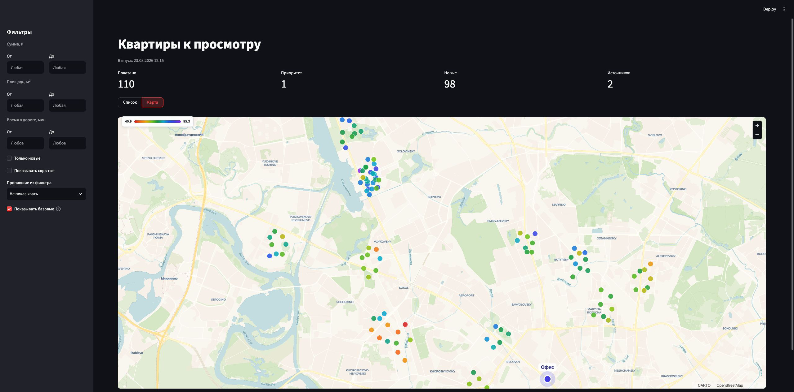
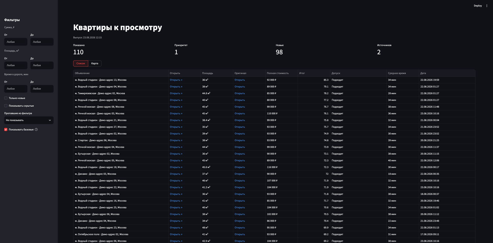
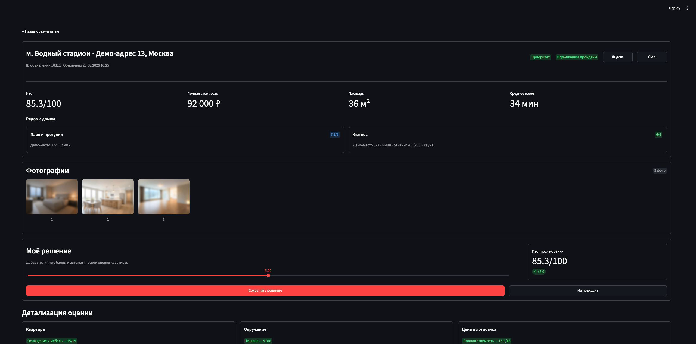

# MoscowFlatFinder

**A personal, agent-built apartment search workflow for Moscow.**

MoscowFlatFinder collects rental listings from Yandex Realty and CIAN, adds the
context I could not get from marketplace filters, and helps me answer one
question: **which apartment should I open first?**

I built it for my own search, not as another universal real estate product. The
code is public because someone else may find the same approach useful with
criteria that fit their life.

## The problem I was trying to solve

I got tired of living in a noisy apartment next to a highway. This time I want a
quiet neighborhood, a proper park within walking distance, a modern interior I
actually enjoy, and a commute that does not eat half the day. I also do not want
to overpay just because a listing has glossy photos and a good description.

Aggregators can filter by price, size, rooms, or metro station. They do not tell
me whether a particular building is noisy, whether a nearby green patch is
actually a good park, how long the real commute will take, how fresh the
renovation looks, or whether the asking price makes sense next to similar
apartments.

The result is still a long feed that has to be compared by hand. MoscowFlatFinder
turns my preferences into explicit checks and a readable score, so I can see
both the ranking and what earned it.

## What the result looks like

The map made the neighborhood-level pattern visible. In my search, Vodny
Stadion stood out because good listings appeared there as a concentration, not
as isolated outliers.



The table turns incoming listings into a viewing queue instead of another feed
to scroll through.



Each listing explains the score and still leaves room for personal judgment.



The screenshots come from the real workflow with synthetic demo listings and no
personal addresses, links, coordinates, or third-party photos.

## How it works

1. **Collect** listings from saved Yandex Realty and/or CIAN searches.
2. **Enrich** them with commute, nearby places, noise context, and optional
   visual analysis of the photos.
3. **Evaluate** non-negotiable requirements separately from weighted criteria.
4. **Review** the shortlist in a local table, map, and detailed listing card.
5. **Refine** the criteria and neighborhoods as the search teaches me what
   matters in practice.

## Product choices that mattered

- **Personal criteria, not a universal rating.** Score weights, thresholds, and
  maximum points live in the local config.
- **Hard requirements stay hard.** A listing is eligible, needs review because a
  fact is missing, or is rejected because a known requirement fails.
- **Unknown is not the same as bad.** Missing evidence stays visible instead of
  quietly turning into a zero.
- **The score does not have to total 100.** Disabled criteria disappear from the
  denominator, so a setup can use `34/49`, `54/66`, or any other useful maximum.
- **The decision stays inspectable.** The interface shows the contribution of
  price, apartment, commute, surroundings, and photos instead of only a total.

## Built with agents

I built MoscowFlatFinder with Codex and Claude Code in agent mode: shaping the
requirements, turning fuzzy preferences into explicit rules, testing the
workflow on my own apartment search, and iterating until it became useful.

The interesting part was not generating code. It was turning a messy personal
decision into a system I could inspect, question, and improve.

The same approach is used to configure a new search. I strongly recommend Matt
Pocock's
[`grill-me` skill](https://github.com/mattpocock/skills/tree/main/skills/productivity/grill-me)
for turning vague preferences into explicit trade-offs before touching the
scoring config.

## Want to try it for your own search?

The current version supports Apple Silicon macOS, Python 3.12–3.14, and `uv`.

```sh
git clone https://github.com/ibelyasov/moscow-flatfinder.git
cd moscow-flatfinder
```

Open the repository in Codex or Claude Code and say:

> Set up MoscowFlatFinder for my apartment search. Follow
> docs/agent-onboarding.md, ask me one question at a time, and do not start a
> full collection without my confirmation.

The agent will prepare a private runtime directory, interview you about the
search, create the config, validate it, and begin with a limited run. The full
walkthrough lives in
[docs/agent-onboarding.md](docs/agent-onboarding.md).

The intended path is:

1. define non-negotiables and scoring criteria;
2. research a starting set of neighborhoods and metro stations;
3. create and manually confirm marketplace searches;
4. collect a small sample and inspect the extracted facts;
5. refine the areas, weights, and thresholds;
6. schedule the workflow with Codex, Claude, Hermes, or `launchd` once it works.

## What is under the hood

The core works without API keys and includes Yandex Realty and CIAN collection,
deduplication, SQLite history, deterministic JSON export, and a local Streamlit
review interface.

Optional modules add:

- **Geo** — 2GIS places and geocoding plus Yandex Maps commute routes;
- **Noise** — a local OpenStreetMap layer for roads and railways;
- **Vision** — Codex CLI or Claude CLI for renovation, layout, natural light,
  and view assessment. The model is configurable; the recommended profile is
  Codex with `gpt-5.6-luna` and `medium` effort.

## Privacy and limits

Personal data stays outside Git in
`~/Library/Application Support/MoscowFlatFinder`: saved-search URLs, commute
addresses, config, browser state, cookies, databases, photos, exports, logs, and
scheduler files. The repository contains examples only.

This is a personal Moscow-first tool, not a hosted service. Other cities are
untested, marketplace page changes can break the adapters, and the current
supported platform is Apple Silicon macOS. It does not bypass CAPTCHA or 2FA.
Vision is a subjective heuristic, and the final apartment decision remains a
human one.

## Tech stack

Python, `uv`, Crawlee, Playwright, Chromium, SQLite, Streamlit, PyDeck, Pillow,
2GIS, Yandex Maps, OpenStreetMap, osmium, Shapely, Codex CLI, and Claude CLI.

## Documentation

- [Agent onboarding](docs/agent-onboarding.md) — configure and validate a new
  personal search.
- [Configuration reference](docs/configuration.md) — capabilities, scoring,
  hard requirements, Vision, paths, and secrets.
- [Search case study](docs/case-study.md) — how the neighborhood search evolved
  in practice (in Russian).

<details>
<summary>Development checks</summary>

The project deliberately has no permanent test framework. From the repository
root, run:

```sh
uv sync --project automation --locked
uv run --project automation python -m compileall -q automation/flatfinder
PYTHONPATH=automation uv run --project automation python -c \
  'from flatfinder import admin, cli, export, extract, photos, pipeline, scoring, storage, vision'
uv run --project automation flatfinder --help
sqlite3 "$HOME/Library/Application Support/MoscowFlatFinder/data/listings.sqlite3" \
  'PRAGMA integrity_check;'
git diff --check
```

</details>

## Status and license

The first public release is `v0.1.0`. Issues and pull requests are welcome, but I
cannot promise support or response times. The code is available under the
[MIT License](LICENSE).
