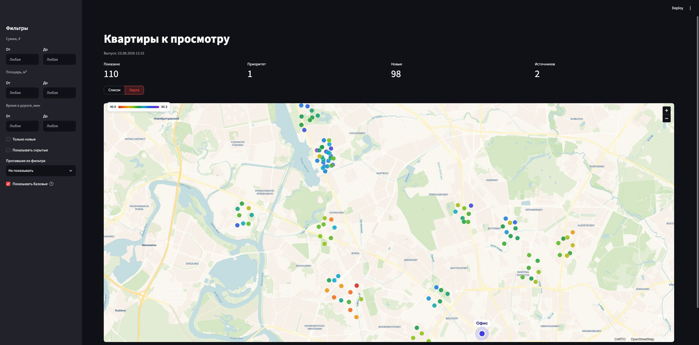
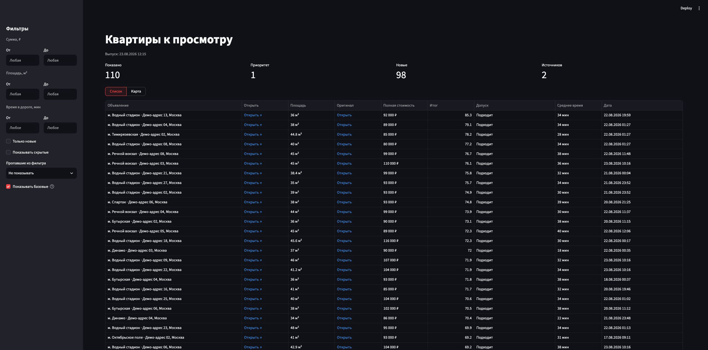
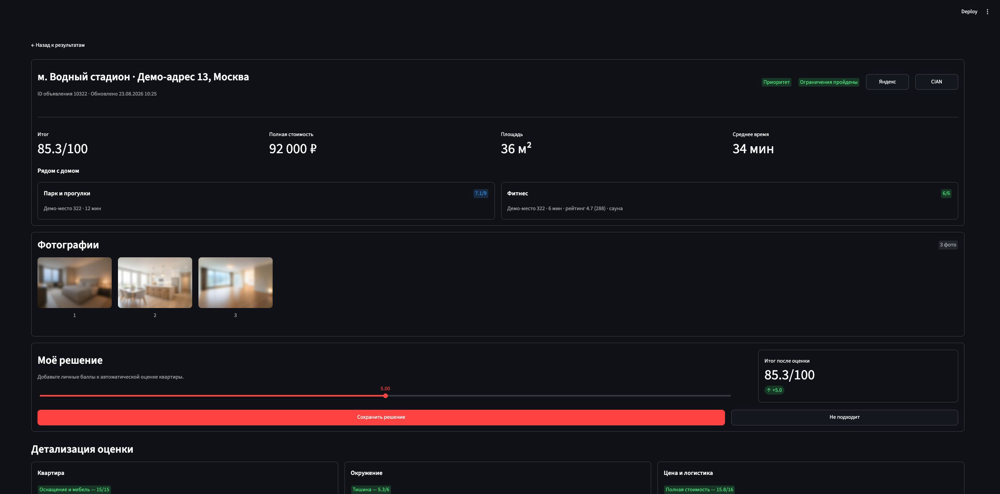

# MoscowFlatFinder

**A personal, agent-built apartment search workflow for Moscow.**

MoscowFlatFinder collects rental listings from Yandex Realty and CIAN, adds the
context I could not get from marketplace filters, and helps me answer one
question: **which apartment should I open first?**

I built it for my own search, not as another universal real estate product. The
code is public because someone else may find the same approach useful with
criteria that fit their life.

## The problem I was trying to solve

I got tired of living in a noisy apartment next to a highway. This time I want a
quiet neighborhood, a proper park within walking distance, a modern interior I
actually enjoy, and a commute that does not eat half the day. I also do not want
to overpay just because a listing has glossy photos and a good description.

Aggregators can filter by price, size, rooms, or metro station. They do not tell
me whether a particular building is noisy, whether a nearby green patch is
actually a good park, how long the real commute will take, how fresh the
renovation looks, or whether the asking price makes sense next to similar
apartments.

The result is still a long feed that has to be compared by hand. MoscowFlatFinder
turns my preferences into explicit checks and a readable score, so I can see
both the ranking and what earned it.

## What the result looks like

The map made the neighborhood-level pattern visible. In my search, Vodny
Stadion stood out because good listings appeared there as a concentration, not
as isolated outliers.



The table turns incoming listings into a viewing queue instead of another feed
to scroll through.



Each listing explains the score and still leaves room for personal judgment.



These screenshots illustrate the earlier interface. For a new demo,
`tools/generate_demo.py` creates a database entirely from invented listings,
without reading a private database or photos.

## How it works

1. **Collect** listings from saved Yandex Realty and/or CIAN searches.
2. **Enrich** them with commute, nearby places, noise context, and optional
   visual analysis of the photos.
3. **Evaluate** non-negotiable requirements separately from weighted criteria.
4. **Review** the shortlist in a local table, map, and detailed listing card.
5. **Refine** the criteria and neighborhoods as the search teaches me what
   matters in practice.

## Product choices that mattered

- **Personal criteria, not a universal rating.** Score weights, thresholds, and
  maximum points live in the local config.
- **Hard requirements stay hard.** A listing is eligible, needs review because a
  fact is missing, or is rejected because a confirmed requirement fails. Estimated
  costs affect soft ranking with partial confidence; they never silently prove a
  hard budget requirement.
- **Unknown is not the same as bad.** Missing evidence stays visible instead of
  quietly turning into a zero.
- **The score does not have to total 100.** Disabled criteria disappear from the
  denominator, so a setup can use `34/49`, `54/66`, or any other useful maximum.
- **Offers stay independent.** Duplicate links never hide another offer or
  transfer its manual score, favorite, or dislike.
- **Vision has a human decision.** Photo analysis is pending until accepted;
  automatic acceptance requires an explicit config choice.
- **The decision stays inspectable.** The interface shows the contribution of
  price, apartment, commute, surroundings, and photos instead of only a total.

## Built with agents

I built MoscowFlatFinder with Codex and Claude Code in agent mode: shaping the
requirements, turning fuzzy preferences into explicit rules, testing the
workflow on my own apartment search, and iterating until it became useful.

The interesting part was not generating code. It was turning a messy personal
decision into a system I could inspect, question, and improve.

The same approach is used to configure a new search. I strongly recommend Matt
Pocock's
[`grill-me` skill](https://github.com/mattpocock/skills/tree/main/skills/productivity/grill-me)
for turning vague preferences into explicit trade-offs before touching the
scoring config.

## Want to try it for your own search?

The current version supports Apple Silicon macOS, Python 3.12–3.14, and `uv`.

```sh
git clone https://github.com/ibelyasov/moscow-flatfinder.git
cd moscow-flatfinder
```

Open the repository in Codex or Claude Code and say:

> Set up MoscowFlatFinder for my apartment search. Follow
> docs/agent-onboarding.md, ask me one question at a time, and do not start a
> full collection without my confirmation.

The agent will prepare a private runtime directory, interview you about the
search, create the config, validate it, and begin with a limited run. The full
walkthrough lives in
[docs/agent-onboarding.md](docs/agent-onboarding.md).

The intended path is:

1. define non-negotiables and scoring criteria;
2. research a starting set of neighborhoods and metro stations;
3. create and manually confirm marketplace searches;
4. collect a small sample and inspect the extracted facts;
5. refine the areas, weights, and thresholds;
6. schedule the workflow with Codex, Claude, Hermes, or `launchd` once it works.

## What is under the hood

The core works without API keys and includes Yandex Realty and CIAN collection,
reversible cross-source duplicate links, SQLite observations, deterministic JSON
export, and a local Streamlit review interface.

Optional modules add:

- **Geo** — 2GIS places and geocoding plus Yandex Maps commute routes;
- **Noise** — a local OpenStreetMap layer for roads and railways;
- **Vision** — Codex CLI or Claude CLI for renovation, layout, natural light,
  and view assessment. Provider, model and effort are explicit local choices.

The application is a modular Python monolith under `src/flatfinder`. `config`
validates the current TOML without accessing credentials. `application` owns user
operations, `collection` runs Playwright sequentially, and `assessment` calculates
one full decision from typed facts and an explicit policy. `database` owns SQL,
schema validation and atomic writes; `read_model` supplies the same view to `ui`
and deterministic JSON export. One current observation and one ordered photo set
are authoritative. Restarting collection repeats discovery; completed observations
remain saved, and presence is tracked separately for each search.

Each assessment stores its policy. Config or effective Vision prompt changes
make older assessments stale; review never recalculates them. Use explicit
`reassess` from saved facts. It preserves manual decisions and makes no provider
calls. Geo/Noise facts retain their acquisition context; pure reassessment cannot
confirm measurements for a changed destination, departure time or Noise map.
`enrich [ID] [--force]` acquires enabled Geo/Noise measurements;
`vision ID [--force]` analyzes one current gallery, and
`vision-review RUN_ID --accept` or `--reject` records the human decision.

`--config` is a global option, placed before the command:

```sh
uv run --locked flatfinder --config "/path/to/private/config.toml" doctor
uv run --locked flatfinder --config "/path/to/private/config.toml" reassess 123
uv run --locked flatfinder --config "/path/to/private/config.toml" review --port 8765
```

Review listens on loopback. It does not hold the writer lock for its entire
lifetime; mutations acquire the lock for their operation. `doctor` checks local
files and schema without browser, credentials or inference; it does not prove
provider authentication or live collection readiness.

### Database and offline tools

Normal startup accepts schema 18 only and never migrates schema 17. `init`
explicitly creates a new database. To prepare an offline import, keep the v17
source closed with no pending WAL/journal and choose a separate, nonexistent target:

```sh
uv run --locked python tools/import_v17.py --source /path/to/closed-v17.sqlite3 --target /path/to/new-v18.sqlite3
uv run --locked python tools/generate_demo.py --target /path/to/new-demo.sqlite3
```

The importer reads the source without changing it and publishes a checked new
target atomically without overwrite. IDs and manual decisions are preserved;
current facts come from the saved current hash, with all original records retained
in a technical archive. Old Geo, Vision, assessments and search presence are not
promoted to verified current contracts. Lost recurrence chronology cannot be
reconstructed. Supply `--photo-root /path/to/same-runtime/photos` explicitly to
retain contained local references; otherwise paths and metadata remain archived,
and current photos require download. Files are never copied. The import policy
keeps enough personal points to preserve every old manual score and reports its
fingerprint. Import preparation does not switch the live config or runtime.

Noise uses a version 2 map with explicitly declared complete coverage bounds.
Outside coverage or with an incompatible map, its result stays unknown. Map
rebuild is a separately approved operation; install its optional dependencies with
`uv sync --locked --extra noise`. See the configuration reference for the command.

Backups are explicit: `flatfinder backup` creates a verified SQLite backup;
`backup --keep N` additionally prunes older backups. Collection never creates or
prunes backups automatically. Live migration, runtime switching, provider work,
full collection, mass Vision refresh, schedules and backup/prune operations retain
their separate approval boundaries.

## Privacy and limits

Personal data stays outside Git in
`~/Library/Application Support/MoscowFlatFinder`: saved-search URLs, commute
addresses, config, browser state, cookies, databases, photos, exports, logs, and
scheduler files. The repository contains examples only.

This is a personal Moscow-first tool, not a hosted service. Other cities are
untested, marketplace page changes can break the adapters, and the current
supported platform is Apple Silicon macOS. It does not bypass CAPTCHA or 2FA.
Vision is a subjective heuristic, and the final apartment decision remains a
human one.

## Tech stack

Python, `uv`, Playwright, Chromium, SQLite, Streamlit, PyDeck, Pillow,
2GIS, Yandex Maps, OpenStreetMap, osmium, Shapely, Codex CLI, and Claude CLI.

## Documentation

- [Agent onboarding](docs/agent-onboarding.md) — configure and validate a new
  personal search.
- [Configuration reference](docs/configuration.md) — capabilities, scoring,
  hard requirements, Vision, paths, and secrets.
- [Search case study](docs/case-study.md) — historical record of how the
  neighborhood search evolved in practice (in Russian).

<details>
<summary>Development checks</summary>

The project deliberately has no permanent test framework. From the repository
root, run the checks below; SQLite verification uses an isolated synthetic database,
never the personal runtime:

```sh
uv sync --locked --extra noise
.venv/bin/python -m compileall -q src/flatfinder tools
.venv/bin/python -c 'import importlib, pkgutil, flatfinder; [importlib.import_module(m.name) for m in pkgutil.walk_packages(flatfinder.__path__, flatfinder.__name__ + ".")]'
.venv/bin/flatfinder --help
.venv/bin/flatfinder reassess --help
.venv/bin/python -c 'from flatfinder.database import Database; d=Database.initialize(":memory:"); assert d.health()["ok"]; d.close()'
.venv/bin/python -c 'from flatfinder.config import load_config; from flatfinder.scoring import score_maxima; c=load_config("examples/config.toml"); assert score_maxima(c.policy["max_scores"]) == (39.0, 10.0, 49.0)'
git diff --check
```

CI runs the same checks on Python 3.12, 3.13 and 3.14, without installing Chromium
or calling providers. This verifies source and local contracts, not browser or
live runtime acceptance. Keep focused temporary smoke scripts, synthetic SQLite
fixtures, logs and timings outside Git. If using an existing interpreter directly,
set `PYTHONPATH=src` and use `python -B`; the supported commands and examples live
at the repository root. Root dependency sync is a separate check from using an
already installed environment; the checks use it directly without repeating sync.

CI also builds a tiny generated local OSM layer through the application command
boundary. The `noise` extra adds only its native parser; no map download, browser
installation, provider call, service or VM is part of verification.

</details>

## Status and license

The first public release is `v0.1.0`. Issues and pull requests are welcome, but I
cannot promise support or response times. The code is available under the
[MIT License](LICENSE).
